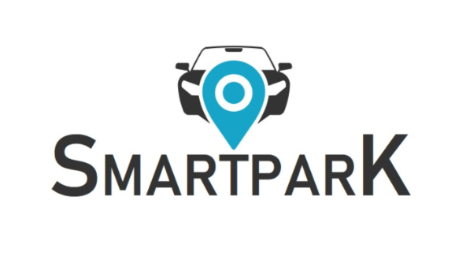
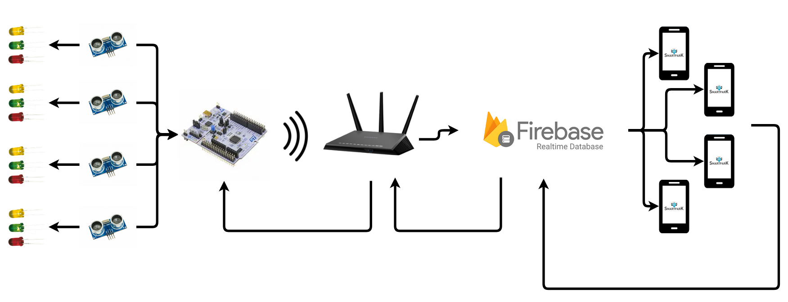
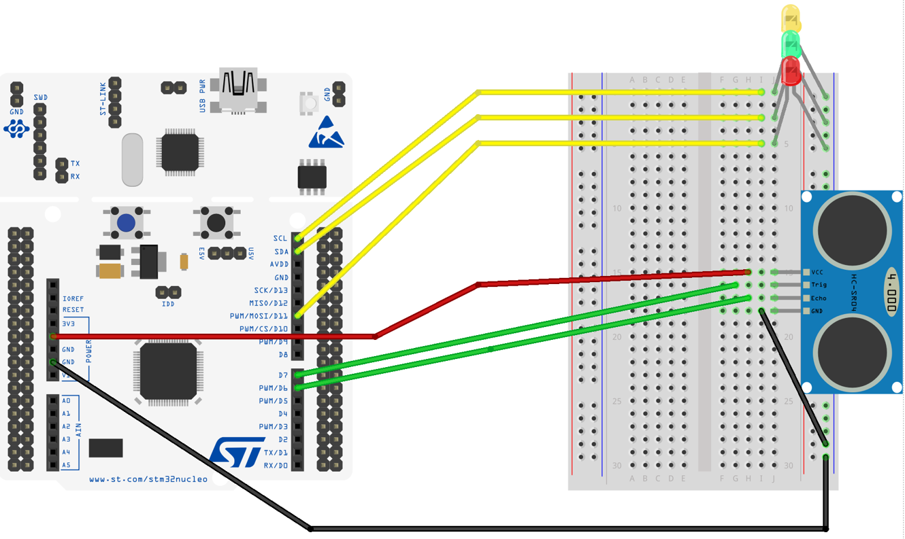

# SmartPark

This is the repository for SmartPark project deeply described [here](https://www.hackster.io/Marco_Ferraro/smart-park-3d3c49) on Hackster.

## Team
We are three Master of Engineering in Computer Science students at "La Sapienza" university in Rome:

[Marco Ferraro](https://www.linkedin.com/in/marco-ferraro-86aa53182/), [Davide Giordano](https://www.linkedin.com/in/davide-giordano/) and [Riccardo Pattuglia](https://www.linkedin.com/in/riccardo-pattuglia-3a09ab182/)

## Overview
The idea came out since every day it seems more difficult to find parking spots especially inside shopping centers' parkings during festivities, when the malls are crowded, and people get frustrated by the amount of time lost.

The main purpose of our project is to provide a map of the parking lot updated in real time so that you can go straight to a free spot avoiding that someone who comes after you takes a spot you didn't notice. We implemented a notification system so that you can know if someone is going to leave his place whitin five minutes as well.
Moreover it's possible to reserve a spot so that you can go straight to your reserved spot when you arrive.

## What we have used
 - [Nucleo-F401RE](https://os.mbed.com/platforms/ST-Nucleo-F401RE/)
 - [X-Nucleo-IDW01M1](https://www.st.com/content/st_com/en/products/ecosystems/stm32-open-development-environment/stm32-nucleo-expansion-boards/stm32-ode-connect-hw/x-nucleo-idw01m1.html)
 - [Ultrasonic Sensor HC-SR04](https://cdn.sparkfun.com/datasheets/Sensors/Proximity/HCSR04.pdf)
 - [Mbed OS](https://www.mbed.com/en/platform/mbed-os/)
 - [Firebase](https://firebase.google.com)
 - [Android Studio](https://developer.android.com/studio/)
 
 ## Architecture ##
 
For every parking slot there's and ultrasonic sensor and three LEDs to signal if the spot is either free, occupied or reserved (green, red and yellow). Everything is connected and handeled by the Nucleo board, which sends an HTTPS request to Firebase throught the Wi-Fi module whenever the sensors' logic determines a state change. The Firebase database changes state for the corresponding parking slots and the Android application reads from it to draw the state map.

Whenever an user makes a reservation, data is sent to Firebase to modify the state of the reserved slot and the board recieves the new state, switching on the yellow LED accordingly.

 
 ## How it works
The project is divided in two parts: 
- the configuration and building of the IoT device able to check the presence of a car and update the status of the server.
- the Android application to see the parking map which relies on the ultrasonic sensors, mounted on the ceiling above every parking spot, to check the presence of a car on each spot.
Through the usage of the Wi-FI module, the board sends HTTPS requests to Firebase when the sensor notices a change of the state, the distance detected has changed.

In the Firebase Real-Time Database, every sensor updates the state of the spot and all the Android devices are notified of the change.
The application draws the parking lot map indicating the spots state with different colors.
It is also possible to reserve a spot within the Android application, inserting the car plate and estimated time of arrival.
Whenever you are leaving, you can also notify your departure, so that everybody can be aware of it.
To encourage the users to notify their departure there is a bonus points system to get discounts.

## How to use
You can finde the Java code for Android Studio under the "Android" folder and the code for MbedOS under the "STM_F401" folder.
Once you have downloaded the files you can connect the board with the sensors with the schematics provided below and insert the code in the applications.
You can also refer to the [blog post](https://www.hackster.io/Marco_Ferraro/smart-park-3d3c49) where you can find more detailed instructions. 

####
## STM board Configuration ##
 

## Android Application User Interface

Below you can see the user interface for checking different parking lots, your active reservations and your bonus points status.

To make a reservation, select a free parking spot, insert your car's plate and your estimated time of arrival (within one hour) and you are good to go! You can then signal your departure 5 minutes beforehand and gain bonus points!

